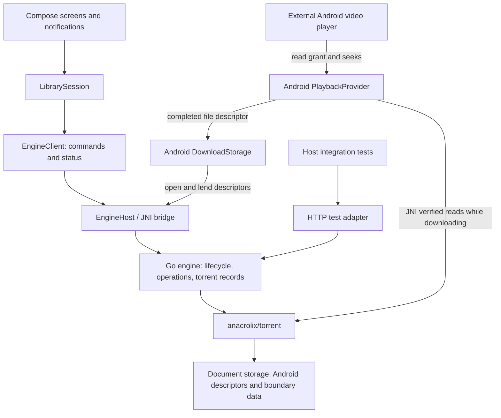

# Go engine integration and reliability plan

Date: 2026-09-15  
Baseline: `go-engine` at `8d8acbf`, including the existing uncommitted migration changes.  
Status: JNI control, native change notifications, size cleanup, and playback changes implemented; this APK needs a new physical-device playback test.  
Scope: Finish the Android/Go integration, fix intermittent add/return failures, make pause/resume reliable, and verify streaming and saved downloads.

## 1. Main findings

### Current implementation (2026-09-15)

- [x] Replace Android's fixed HTTP control listener and OkHttp with JNI commands using the same Go handlers.
- [x] Replace Kotlin's repeating status, metadata and piece polling with cancellable native change notifications. Go still samples transfer telemetry once per second and emits only changes.
- [x] Remove bundled Adwaita fonts and the unused anet mobile binaries. Android uses the system sans-serif font.
- [x] Remove direct UUID generation dependency; retain `google/uuid` indirectly because WebRTC ICE requires it.
- [x] Report verified file completion; preserve final verification notifications and command-generation guards.
- [x] Give external players a seekable Android content URI with size/name/MIME metadata. Incomplete reads use verified native torrent readers; completed reads open the saved destination.
- [x] Cover partial reads, shared file boundaries, seeking, close cancellation, HTTP ranges, native command errors/events, and local TCP peer transfer plus MP4 decode.
- [x] Exercise actual JNI exports, descriptor duplication, UTF-8, events, pause/resume and binary playback under host JVM CheckJNI.
- [ ] Test the final APK in the user's Android player (phone currently disconnected).

The findings and phase checklist below document the original migration audit. The app now embeds `libengine.so` and sends commands through JNI in the same Android process.

**The most urgent defect is a reproduced panic during magnet addition.** `handleAdd()` calls `DownloadAll()` before metadata is available. The torrent library dereferences missing metadata, Go's HTTP server closes the connection, and the caller receives EOF. The torrent has already been added to the underlying client but has not been registered in the app's record map.

This is a concrete explanation for an add failing with a localhost connection error. The user's sequence—go back, return, add again, sometimes succeed—also needs the cancellation and storage-reuse fixes below. The exact phone sequence has not yet been reproduced on a device.

The loopback control layer is unnecessary for the intended final integration, but its performance overhead has not been measured. Replacing it alone would leave the metadata panic and storage defects intact. Fix the engine's behavior first, then call that same engine directly through JNI.

## 2. Target architecture



### Decisions to implement

- Use **direct JNI for app control**: add, configure, select, pause, resume, remove, settings, metadata, stats, and pieces. Preserve the existing Kotlin models and JSON fields initially to keep the migration manageable.
- Use **Android content URIs for player launches**, with JNI proxy reads while downloading and saved file descriptors after completion. Keep the local HTTP media endpoint for compatibility/testing.
- Extract engine operations from HTTP handlers. Both the JNI bridge and the host-test HTTP adapter call the same operations. Do not implement separate behavior for each transport.
- Keep the library, selected destination URIs, and user intent in Kotlin persistence. Go owns live torrent handles, transfer state, verified piece state, and readers.
- Keep descriptor transfer within the same process. Kotlin retains originals until Go has duplicated and accepted them; failure closes only the duplicates acquired for that attempt.
- Use one process-wide engine host with explicit `Starting`, `Ready`, `Failed`, `Stopping`, and `Stopped` states. Leaving a screen must not stop the engine.
- Keep the HTTP control adapter for testing/development; the production Android client will no longer depend on port `18080`.

## 3. Evidence and defect list

`R` = reproduced locally using the current Go source. `S` = confirmed by source inspection; device effects still require validation.

| Priority / evidence | Defect and effect | Source |
| --- | --- | --- |
| P0 / R | Magnet add before metadata panics at `DownloadAll()`, returns connection EOF, and leaves an underlying torrent with no API record. | `engine-go/server.go:352`, especially `:441`; pinned library `t.go:258` |
| P0 / R | Pause returns success but status always says `paused: false`. App polling overwrites the paused UI state. Changing file priority also leaves the piece priority established by `DownloadAll()` in place. | `engine-go/server.go:573`, `:763`; `LibrarySession.kt:1490` (`applyStatus`) |
| P0 / R | Close/reopen of the same infohash reuses storage with `attached=true`, missing file handles, and stale completion flags. Reattachment returns success without attaching. A read returned four zero bytes while reporting the piece complete. | `engine-go/storage.go:31`, `:121`, `:260`, `:356` |
| P0 / R | A piece spanning selected and unselected files loses the unselected bytes. Read-back changed `AAAABBBB` into `AAAA` plus four zeros. Such a piece cannot pass verification against the original torrent data. | `engine-go/storage.go:195`, `:224` |
| P0 / R | Once fallback storage is active, descriptor attachment returns success immediately. Subsequent writes go to fallback storage; the selected Android destination can remain empty. | `engine-go/storage.go:121`, `:168`, `:280` |
| P0 / S | Truncation and cache-flush errors are ignored; incomplete descriptor arrays are accepted; a partially failed attachment can leak descriptors or leave mixed state. | `engine-go/storage.go:121–192` |
| P1 / S | `prepare=true` still calls `DownloadAll()` and enables transfers. `/select` changes priorities during preparation. This violates the intended metadata/file-selection stage and interacts badly with premature fallback activation. | `engine-go/server.go:441`, `:723`; `LibrarySession.kt` `syncPrepareSelection()` |
| P1 / R | The declared memory-cache limit is never enforced. A probe with a four-byte limit stored eight bytes successfully. | `engine-go/storage.go:306–337` |
| P1 / S | Restored pieces default to known-incomplete (`Ok: true`) without checking existing destination data. The pinned library skips initial verification when completion is known. Restore can redownload existing content. | `engine-go/storage.go:356`; pinned library `torrent.go` `queueInitialPieceCheck()` |
| P1 / S | Add deduplication has a check-then-add race. Record lookup does not protect later field reads or underlying operations against concurrent configure/remove/status calls. | `engine-go/server.go` record maps and handlers |
| P1 / S | Play/configure/select/stream wait on metadata without observing request cancellation or torrent closure. Pending operations can outlive Back, removal, or a failed request. | `engine-go/server.go:608`, `:690`, `:740`, `:1008` |
| P1 / S | Native startup errors were only logged, the host's `started` flag never reset, control-port fallback was invisible to Kotlin, and engine shutdown called `os.Exit(0)` inside the Android process. | `EngineHost.kt`; `engine-go/server.go`; `engine-go/main.go` |
| P1 / S | Polling silently discards transport exceptions, while other engine errors can incorrectly clear a valid engine ID. Startup readiness is not an engine-recovery mechanism. | `LibrarySession.kt` `pollLoop()`, `markMissingEngine()`, `waitForEngine()` |
| P1 / S | Playback can choose an unselected file, accepts an invalid explicit index by selecting another file, and sets head/tail priorities beyond the selected file's exact bounds. Stream errors and bytes sent are not recorded. | `engine-go/server.go:591`, `:983` |
| P2 / S | Every torrent receives global speeds, ETA is seconds while Kotlin expects milliseconds, uploaded bytes/ratio are placeholders, every piece bucket is marked selected, and settings do not update live connection limits. | `engine-go/server.go` stats/status/pieces/settings; `Formatters.kt:50` |
| P2 / S | Removal ignores `destroyStore`; storage entries are never evicted. Fallback paths are based on names rather than isolated torrent identities. Native build/docs/distribution files still have migration inconsistencies. | `engine-go/server.go:803`; `engine-go/storage.go`; `README.md`; `webtor.app.yml` |

### Local reproduction results

Six isolated characterization probes ran against copies of `server.go`, `storage.go`, and `types.go`, using the repository's pinned dependencies. They confirm existing defects; their passing result does **not** mean the implementation is correct.

```text
metadata-pending POST /add -> EOF
stack: Info.NumPieces -> Torrent.DownloadAll -> EngineServer.handleAdd:441
after failure: API records=0, underlying client torrents=1

POST /pause -> 200; subsequent paused=false; piece priority remains normal
storage close/reopen -> [0 0 0 0], Complete=true, destination_attached=false
shared piece -> "AAAABBBB" becomes "AAAA\x00\x00\x00\x00"
configure after fallback -> success, destination remains empty
cache -> 8 bytes stored with a configured 4-byte limit
```

Temporary reproduction package: `/tmp/webtor-go-audit-ftr5givb`. It can be rerun with `go test -v -count=1 -timeout=45s ./...` in that directory. Phase 0 converts these cases into durable regression tests asserting the desired behavior.

### Corrections to HANDOFF.md

- Treat the existing “100% compatible” and playback-fixed statements as unverified historical claims. Current behavior contradicts them.
- In pinned `anacrolix/torrent` v1.61.0, `SetReadahead()` already clears `readaheadFunc`. The handoff's claim that it requires a separate clearing call is inaccurate. Responsive mode does bypass whole-piece verification, but that does not establish it as the cause of this user's error. [Pinned reader implementation](https://github.com/anacrolix/torrent/blob/v1.61.0/reader.go).
- `BytesReadUsefulData` is updated on received useful chunks in the pinned implementation; it is not exclusively a completed-piece counter. Reassess the speed explanation against measurements. [Pinned peer implementation](https://github.com/anacrolix/torrent/blob/v1.61.0/peer.go).
- Zero-padding missing content and ignoring storage errors cannot establish media correctness. Pre-sizing a file does not prove its pieces have downloaded or passed verification.

## 4. Behavior contract

| Action | Required result |
| --- | --- |
| Add a magnet with no metadata yet | Return one stable ID promptly with metadata-pending state. No payload download before destination configuration. Metadata acquisition continues asynchronously. |
| Add the same torrent concurrently | Resolve to one owned record per infohash. Cancellation of one draft must not remove another live owner. |
| Back during add/prepare | Invalidate that draft's work and release only its uncommitted engine resource. Returning and adding again succeeds. |
| Change draft selection | Update draft selection; empty selection is allowed here. Do not start content downloads. |
| Configure destination | Validate every selected index and corresponding descriptor, attach transactionally, then allow selected downloads. Invalid input leaves the prior state usable. |
| Pause download | Preserve the ID, selection, destination, and verified progress. Stop new payload downloads/uploads and scheduling after bounded in-flight work settles. All subsequent snapshots report paused. |
| Resume download | Re-enable transfer for precisely the selected files. Clear earlier transfer-disable state after a recoverable error only when storage is usable. Repeated resume is safe. |
| Play a paused, incomplete selected file | The app explicitly resumes it before playback. A player/thumbnail request must not independently undo the user's download pause. |
| Pause while streaming | Already available media may play from buffers. Requests requiring missing data must stop or report an intentional pause; they must not silently resume downloading. Resuming and pressing Play again must work. |
| Stop/remove while preserving files | Cancel owned work, close descriptors/readers, evict the live storage object, preserve destination data. Re-add must create a valid new storage session. |
| Delete files | Kotlin deletes its owned destination URIs after engine removal. Go cleans its owned temporary/boundary data according to the removal policy. |
| Process recreation | Reopen selected destinations, verify reusable data, and restore saved intent. Entries saved as paused remain paused. Obtain new live IDs/stream URLs as needed. |
| Invalid/transient operation | Return a structured error with operation, code, retryability, and useful context. Retain a valid library entry and avoid endless spinners or silent state loss. |

Keep library lifecycle and engine state related but distinct: metadata-pending, configured, paused, checking, transferring, complete, failed, and removed must have defined transitions. A late status snapshot must not overwrite a newer command result.

## 5. Implementation checklist, in execution order

### Phase 0 — Make the failing behavior testable

- [ ] Separate Android JNI/logging code from host-buildable engine code using appropriate files/build constraints. Standard `go test ./...` must work on Linux without Android headers.
- [ ] Add a local seeder fixture and deterministic tests with trackers/DHT disabled. Include magnet metadata acquisition and a multi-file torrent with shared boundary pieces.
- [ ] Turn the six characterization cases above into regression tests expecting correct behavior. Add the user's Back → return → add sequence to Kotlin session tests.
- [ ] Add request/operation IDs, torrent ID, session generation, and underlying failure logging. Route engine diagnostics into Android logging.

**Exit:** A reproducible failing baseline covers add, reuse, storage boundaries, and pause. Network availability is not required for the baseline.

### Phase 1 — Fix add, cancellation, and engine lifetime

- [ ] Remove unconditional `DownloadAll()` from add. Register records atomically, return before metadata arrival, and restrict metadata-dependent calls to ready torrents.
- [ ] Establish deduplication/ownership for concurrent add and retry. Roll back partially added resources on failure; do not leave client-only torrents.
- [ ] Keep `prepare` metadata-only. Applying draft selection must not assign payload priorities.
- [ ] Replace unconditional metadata waits with cancellable operations or explicit `metadata_not_ready` results. Observe removal and engine shutdown too.
- [ ] Serialize mutations per torrent and take consistent status snapshots. Define lock ordering; do not hold a global engine lock during disk/network waits.
- [ ] Fix draft cleanup so late cancelled work cannot remove a newer draft or an existing download. Preserve and extend the existing Kotlin generation guards.
- [ ] Replace process exit with engine-owned cancellation and `Close()`. Close listeners, active readers, tracker tasks, and torrent resources; return from native execution safely.
- [ ] Surface startup failure and support a deliberate retry. Until JNI control migration is complete, fail explicitly on the requested control port rather than silently changing it.
- [ ] Catch recoverable operation panics at adapter boundaries and report them with stack traces. Fix the triggering defects; an error wrapper alone is insufficient.

**Exit:** A metadata-pending add returns a stable record without EOF. Fifty repeated cancel/re-add cycles leave no orphan torrents. Stopping the engine does not terminate the app process.

### Phase 2 — Repair storage and restoration

- [ ] Evict storage on close/remove; never return a previously closed object as a new attachment. Make close safe to call repeatedly and protect against late old-session closes.
- [ ] Validate descriptor count, selected indices, seekability, and writable local storage. Duplicate into a temporary set, then commit attachment only after all preparation succeeds. Close new duplicates on failure.
- [ ] Treat size adjustment, writes, and cache flush failures as real errors. Preserve existing download bytes during restore; distinguish preparing a new destination from validating an existing one.
- [ ] Preserve bytes needed for pieces spanning selected/unselected file boundaries in a bounded app-private backing store. Support hashing and later reads of the whole piece without substituting zeros.
- [ ] Remove automatic fallback activation from ordinary missing-data reads. For the app workflow, require configured destinations before downloading/playing content. If a legacy/dev fallback path remains, make migration into destination descriptors explicit and transactional.
- [ ] Return accurate byte counts/errors. Mark a piece complete only when its verified data remains readable from the active backing storage.
- [ ] Rehash existing destination data after descriptor attachment. Report unknown completion until verified; do not trust stale flags or force all restored data to known-incomplete.
- [ ] Enforce both cache and boundary-storage budgets. No verified bytes may be discarded unless they can be recovered from backing storage. Metadata-only preparation should need no payload cache.
- [ ] Isolate app-private backing paths by torrent identity; validate torrent paths before creating them. Implement temporary-storage removal without deleting user-owned destinations implicitly.

**Exit:** Byte-for-byte shared-piece tests pass. Stop/re-add and process restore reuse correct data. Failed configuration can be corrected and retried without leaked descriptors or lost downloaded bytes.

### Phase 3 — Make pause, selection, and status authoritative

- [ ] Add explicit paused state to each record; return it consistently in snapshots.
- [ ] Centralize effective piece priorities from selection and active readers. Remove stale priorities left by previous play/download operations.
- [ ] Use the pinned library's transfer controls to disable payload downloads/uploads on pause and re-enable them on resume. Test actual transfer behavior; changing a boolean is insufficient.
- [ ] Preserve user selection through pause/resume. Never interpret an empty selection as “download everything.” Reject empty committed selections while allowing empty drafts.
- [ ] Keep paused/removed torrents from acquiring new payload work through readers, metadata callbacks, or delayed selection updates. Audit peer/discovery work against the documented pause behavior and supported library APIs.
- [ ] Track asynchronous storage/network errors in the torrent record and expose recovery state to Kotlin.
- [ ] Test UI/notification commands and polling together. Retain command-generation protection and avoid optimistic state being overwritten by stale responses.

**Exit:** After in-flight traffic settles, paused payload counters stay stable; repeated resume transfers only selected content. UI, notification, and engine state agree.

### Phase 4 — Integrate app controls directly through JNI

- [ ] Extract transport-independent engine operations and snapshots from `server.go` into focused modules. Keep media serving separate from command dispatch.
- [ ] Introduce an injectable `EngineTransport` behind `EngineClient`. Preserve JSON/model parsing; use a JNI implementation on Android and an HTTP adapter in host tests.
- [ ] Define a versioned JNI command/result envelope. Include engine epoch, operation ID, result or structured error, and record generation where applicable. Keep blocking work off the Android main thread.
- [ ] Make quick commands bounded; cancel long-running work by operation ownership/context. Ensure duplicated-descriptor ownership is settled even if the Kotlin coroutine is cancelled.
- [x] Rename `NodeHost` to `EngineHost`; update `WebtorApp`, JNI exports, native keep rules, and comments together.
- [ ] Replace all direct port-based clients, including the pieces client in `TorrentFilesScreen`. Inject the shared client/host state.
- [ ] Replace HTTP polling for startup with explicit native readiness/failure. An engine epoch change invalidates stale live IDs and stream URLs and triggers controlled restoration.
- [ ] Normalize transport/engine errors in `EngineClient` and `LibrarySession`. Treat missing IDs, temporary unavailability, storage failure, and cancellation differently; do not silently swallow failures.
- [ ] Verify command parity through both adapters, then disable the production HTTP control listener.

**Exit:** Android app commands succeed without a control listener on `18080`. The engine survives screen navigation and reports actionable initialization/recovery failures. An external player can still stream through its media URL.

### Phase 5 — Validate playback and HTTP range behavior

- [ ] Allow playback only for a configured, selected file. Reject an invalid explicit file index; choose the default among selected playable files.
- [ ] Bound head/tail priorities to the target file and release transient priorities when readers close. Measure before changing the current readahead size.
- [ ] Serve verified bytes through the torrent reader. Retain request cancellation and clean up on seek/disconnect/remove.
- [ ] Validate `GET`, `HEAD`, full content, first/middle/tail ranges, open-ended and suffix ranges, invalid ranges, and seek beyond EOF. Check status, `Content-Length`, `Content-Range`, and exact response bytes.
- [ ] Log reader errors and actual response bytes. Before headers, send an appropriate failure; after streaming begins, record and terminate a failed response honestly. Do not hide missing data with padding.
- [ ] Exercise concurrent thumbnail/player reads, repeated seeks, a paused torrent, a removed torrent, no peers, and resumed playback.
- [ ] Test on a physical Android device with the user's player, then at least one additional installed player. Test both a file with metadata at its tail and a different supported container.

`http.ServeContent` already handles range semantics and requires working seeking. Keep it unless tests demonstrate a specific gap; replacing it is not itself an EOF fix. [Go HTTP documentation](https://pkg.go.dev/net/http#ServeContent).

**Exit:** Range payloads match fixture bytes exactly; repeated playback/seeking has no unexplained truncated responses. Intentional cancellation/pause is distinguished from engine failure.

### Phase 6 — Correct metrics, packaging, and documentation

- [ ] Calculate per-torrent rates separately from aggregate rates; report truthful uploaded bytes, progress, selected completion, and ETA in milliseconds.
- [ ] Derive selected piece buckets from actual selection. Keep telemetry generation consistent with command state.
- [ ] Apply changed peer limits to existing and future torrents using the pinned library's supported methods.
- [ ] Remove redundant/manual announcement work if the library already supplies it. Measure connection count, dial rate, throughput, memory, and battery behavior before tuning.
- [x] Make native build setup portable: resolve the configured NDK and record the Go toolchain requirement. Audit Gradle inputs/outputs and APK contents for stale Node assets/libraries.
- [ ] Update the source-build recipe, F-Droid metadata, licenses, architecture docs, and `HANDOFF.md` to describe the actual Go build and verified results. Preserve the old JS implementation only as a clearly identified reference if still useful.
- [ ] Verify release JNI names/keep rules and the currently supported ABI/API combinations. Add further ABIs only with build and device/emulator coverage.

**Exit:** A fresh checkout produces an APK with the intended Go runtime, documented toolchain, and accurate reported behavior.

## 6. Required regression and device matrix

| Scenario | Pass condition |
| --- | --- |
| Add magnet before metadata; no peers available | Stable ID, pending state, cancellable operation, no EOF or orphan torrent. |
| Back immediately; Back during metadata; return and add same/different torrent | Fifty deterministic cycles pass; Android navigation run shows one correct live record, no stuck draft. |
| Duplicate adds and late cancellation | One record per hash; cleanup does not delete another owner. |
| Configure failure/retry, full disk, unavailable destination | Useful error, state rollback, no leaked descriptor, successful retry after correction. |
| Select one file sharing a piece with another | Required boundary bytes remain hash-correct; selected file completes. |
| Pause/resume repeatedly, including notification actions | No sustained payload transfer while paused; selected transfer resumes; all UI state agrees. |
| Stop then resume; remove keeping files then re-add | New working storage handles, original bytes preserved and verified. |
| Background/foreground and process recreation | No duplicate engine, saved intent preserved, reusable bytes recognized. |
| Stream startup, tail seek, repeated seek, simultaneous thumbnail read | Correct headers and exact bytes; bounded reader lifetime and memory. |
| Delete/remove during metadata or stream reads | Owned work exits; no deadlock, late write, or revival of removed entries. |
| Two torrents downloading at different speeds | Distinct accurate rates and selected progress; ETA uses milliseconds. |
| Native startup failure and engine restart | Visible failure/retry, no process exit, no stale endpoint or engine IDs. |

### Checks and current limits

- Completed: `./gradlew :core:test :app:testDebugUnitTest --console=plain` succeeded. Existing reports contain 13 core tests and 29 app tests with zero failures/errors. The core task was up to date; app tests ran during this analysis. These tests do not exercise the live Go engine.
- Completed: six isolated Go characterization probes reproduced the defects listed above.
- Current gap: `go test ./...` in `engine-go/` fails with `jni.h: No such file or directory` on this Linux host. Phase 0 addresses the build boundary rather than hiding the failure.
- Current gap: `adb devices -l` showed no connected device. Phone reproduction, player testing, and background/service behavior remain unverified.
- After implementation: run host Go tests and `go test -race ./...`, Kotlin core/app tests, `:app:assembleDebug`, release build/JNI verification, and the device matrix. Keep logs of failed operations and stream reads with each result.

## 7. Completion criteria

- [x] Read the existing handoff, engine, client, storage, navigation, and lifecycle paths.
- [x] Reproduce a localhost add EOF and identify the metadata-readiness panic.
- [x] Reproduce pause/status and storage-reuse defects.
- [x] Record the architecture and ordered implementation plan.
- [x] Fix metadata-pending magnet add without `DownloadAll()` panic/EOF.
- [x] Make pause/resume state authoritative and disable/enable payload transfer.
- [x] Replace closed storage sessions, enforce cache bounds, and preserve cross-file piece bytes.
- [x] Make descriptor attachment transactional and verify reusable destination data.
- [x] Replace process-killing shutdown and make the Go engine host-testable without Android headers.
- [ ] Complete Phases 0–6 and retain regression coverage.
- [ ] Reproduce and verify the user's Back → return → add workflow on Android.
- [ ] Verify pause/resume, selected downloads, saved-file restore, and actual player streaming end to end.
- [ ] Replace historical handoff claims with evidence from the fixed implementation.

This document is the planning deliverable. No application or engine source fixes were made during this analysis; existing migration edits were preserved.
