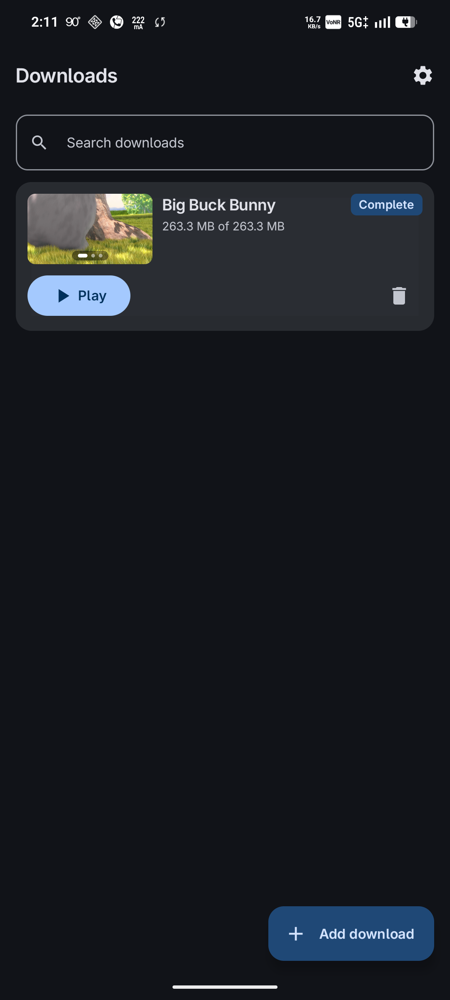
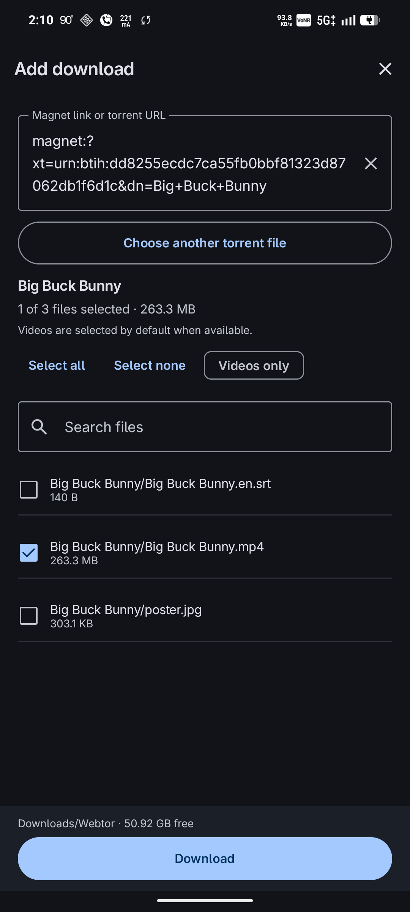
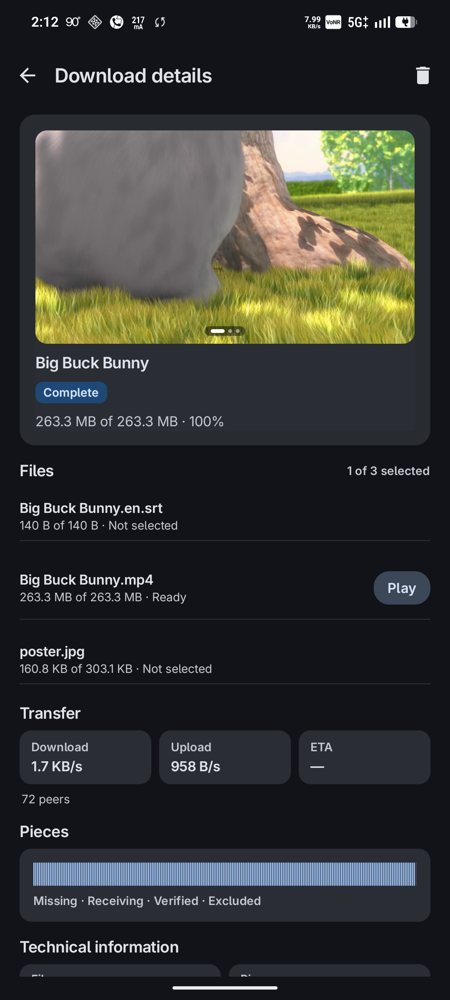

# Torrent Player

<p align="center">
  
  <h2 align="center">Torrent Player</h2>
  <p align="center">
    <strong>Fast, native, battery-friendly torrent downloader and streaming player for Android.</strong>
  </p>
  <p align="center">
    <a href="https://developer.android.com"></a>
    <a href="https://m3.material.io"></a>
    <a href="https://webtorrent.io"></a>
    <a href="LICENSE"></a>
    <a href="https://github.com/karmugilen/torrent-player/releases"></a>
  </p>
</p>

---

## Screenshots

<p align="center">
  &nbsp;
  &nbsp;
  
</p>
<p align="center">
  <sub><b>Left:</b> Library & Video Previews &nbsp;|&nbsp; <b>Center:</b> Add Magnet & File Selection &nbsp;|&nbsp; <b>Right:</b> Details, Swarm Telemetry & Pieces</sub>
</p>

---

## Key Features

- **Single-Contract Workflow**: Straightforward pipeline: **Magnet / Torrent $\to$ Local Storage (`Downloads/Webtor`) $\to$ Stream / Play**. No confusing virtual containers or temporary caches.
- **In-Progress Streaming & Per-File Playback**: Launch directly into your favorite Android video player (VLC, Nova Player, Just Player, MPV, etc.) while downloading progresses, or play finished videos anytime.
- **Selective File Downloads**: Choose exactly which files, episodes, or bonus materials to download from multi-file torrents.
- **Battery-Friendly & Low-RAM Stability**:
  - Constrained **V8 memory cap (96MB)** to prevent Out-Of-Memory crashes on low-spec devices.
  - Adaptive polling back-off (up to 8s idle interval) to conserve battery during background downloads.
- **Modern Material 3 Design**: Built with Jetpack Compose featuring dynamic colors, light and dark themes, interactive piece bitfield visualizer, and animated video preview frames.
- **Full Swarm Connectivity**: Connects to seeds and peers via DHT, UDP trackers (OpenTrackr and more), and WebTorrent WebSocket trackers, transferring data over TCP, native uTP, and WebRTC data channels.

---

## Installation

Download the latest APK release from [GitHub Releases](https://github.com/karmugilen/torrent-player/releases).

Install via ADB or your device's package installer:
```bash
adb install -r torrent-player.apk
```

---

## Using the App

1. **Add a Torrent**: Paste a magnet link or open a `.torrent` file. The app inspects the metadata and displays the file selection sheet.
2. **Select Files & Destination**: Choose the specific files to download. Files are stored directly in `Downloads/Webtor`. A fresh install does not require broad "All Files Access" storage permissions.
3. **Download & Play**:
   - Tap **Download** to start fetching pieces.
   - Tap **Play** on any video item to open Android's native app picker and stream in-progress or completed files immediately in your chosen media player.
4. **Library & Persistence**: Downloads persist in your library across application restarts. Previously saved metadata-only entries remain safely paused until you explicitly choose Download.
5. **Background Operation & Controls**:
   - **Pause** stops swarm peer connections while keeping downloaded files intact.
   - **Delete** provides the option to remove the entry while either keeping or erasing downloaded media from disk.
   - Ongoing background notifications keep active transfers alive and feature a single-tap **Stop** action to pause downloads conveniently from the notification shade.

---

## Architecture & Swarm Engine

```
┌─────────────────────────────────────────────────────────────┐
│                 Android Application Layer                   │
│      Jetpack Compose (Material 3) • Foreground Service      │
│            LibrarySession • Storage Management              │
└──────────────────────────────┬──────────────────────────────┘
                               │ Loopback IPC (127.0.0.1)
┌──────────────────────────────▼──────────────────────────────┐
│                    Swarm Engine Runtime                     │
│      nodejs-mobile (Node 18.20.4) • WebTorrent 2.2.1        │
│       Native uTP & WebRTC Channels • V8 Memory Cap (96MB)   │
└─────────────────────────────────────────────────────────────┘
```

- **Android Host (`android/app/`, `android/core/`)**:
  - Written in Kotlin with Jetpack Compose.
  - Manages Android foreground services, notifications, intent dispatch to external media players, and library state persistence.
- **Engine Runtime (`engine/`)**:
  - Embedded `nodejs-mobile` (Node 18.20.4) runtime executing `webtorrent@2.2.1`.
  - Built-in native C++ addons for uTP protocol support and WebRTC data channels.
  - Communicates with the Android host through a secure, local-only HTTP/JSON bridge on `127.0.0.1`.

---

## Building from Source

### Prerequisites
- Linux, Git, GCC/G++, Make, rsync, Python 3 and setuptools
- Android SDK platform 34, build tools 34.0.0, NDK 26.1.10909125 and CMake 3.22.1
- Node.js 18+ and `npm`
- Java 17 or 21; set `JAVA_HOME` and `ANDROID_HOME` for your machine

### Build Steps

```bash
# 1. Fetch pinned native sources and install JavaScript dependencies
git submodule update --init --recursive
git clone --depth 1 --branch v18.20.4 \
  https://github.com/nodejs-mobile/nodejs-mobile.git vendor/nodejs-mobile/source
npm --prefix engine ci --omit=optional --omit=dev --ignore-scripts

# 2. Build the Node runtime and native addons from source (first build is slow)
# vendor-node.sh verifies the exact source revision before compiling.
./scripts/vendor-node.sh
./scripts/build-native-addons.sh

# 3. Build an installable development APK
cd android
./gradlew :app:assembleDebug
adb install -r app/build/outputs/apk/debug/app-debug.apk
```

`assembleRelease` produces an optimized, unsigned APK for F-Droid to sign.
Upstream releases use the `WEBTOR_KEYSTORE`, `WEBTOR_STORE_PASSWORD`,
`WEBTOR_KEY_ALIAS` and `WEBTOR_KEY_PASSWORD` environment variables for signing.
Native compilation uses two parallel jobs by default; set `WEBTOR_BUILD_JOBS`
to adjust it. Source builds do not download or reuse prebuilt Node libraries.

F-Droid inclusion is tracked in [merge request !48893](https://gitlab.com/fdroid/fdroiddata/-/merge_requests/48893).
See [the submission notes](docs/FDROID_SUBMISSION.md) for the build recipe and validation status.

---

## Disclaimer & Legal

Use this application only with torrents and media content that you have the legal right to download or distribute. The test fixtures utilized during development and automated verification are open-source Creative Commons videos (*Big Buck Bunny* and *Sintel* &copy; Blender Foundation, licensed under [CC-BY](https://creativecommons.org/licenses/by/3.0/)).

---

## License

This project is licensed under the [MIT License](LICENSE).
